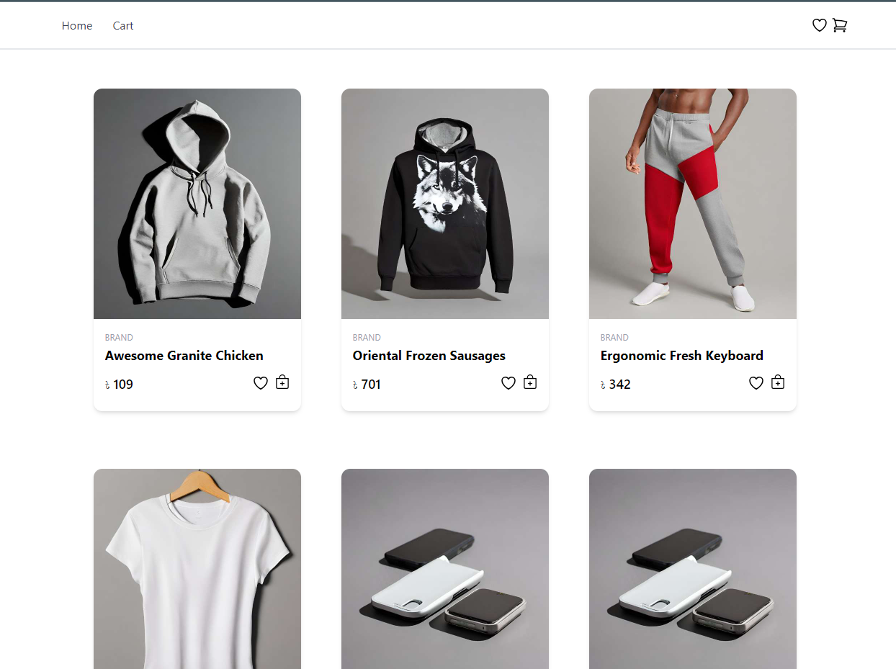
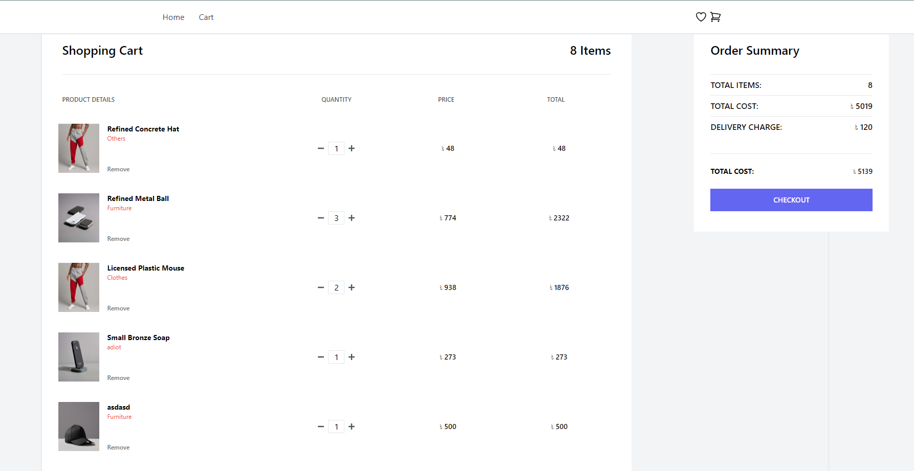
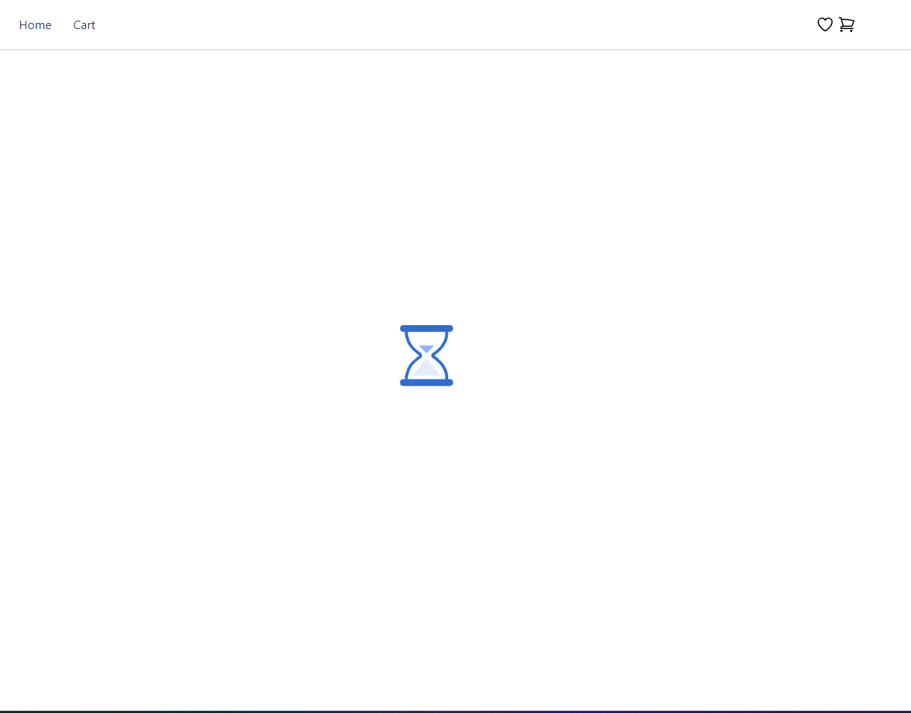
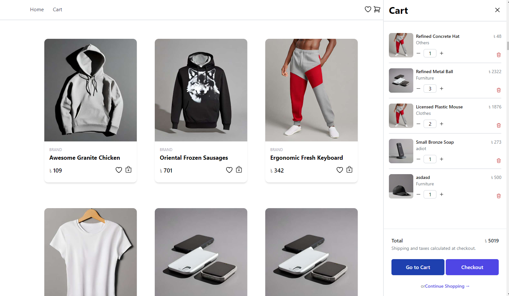
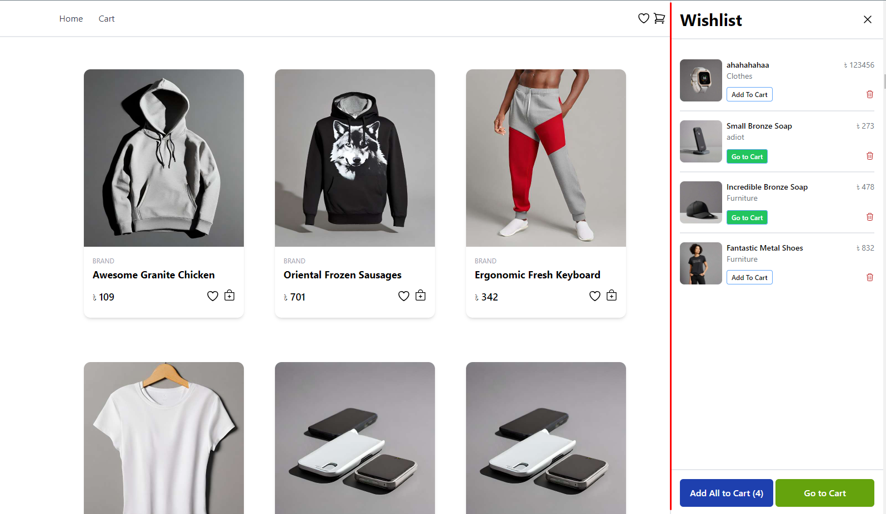

# CartPal - Your Friendly Cart Companion

CartPal: Your cart's best friend. Effortless shopping made simple.  
Live: <a href="https://cart-pal.vercel.app/" target="_blank" >https://cart-pal.vercel.app/</a>

## Installation Guide
If you want to run this project in your local machine, Please follow these steps. And please make sure that you have already setup your node and npm.

- Clone this repo in your machine.
- Open this project with VSCode/Terminal.
- In Terminal, write <code><i>npm install</i></code> (Wait untill all the packages are downloaded).
- Write <code><i>npm start</i></code>.
- It will open in your default browser.

## Tech Stack
 - HTML.
 - CSS.
 - Tailwind CSS.
 - JavaScript.
 - React.
 - React-Redux (For State Management).
 - React Router Dom.
 - React Loader Spinner.
 - Axios.

## Feature:
 - Product Page.
 - Loading UI untill the products are fetched.
 - Lazy load product.
 - Cart Page.
  - Add to Cart.
  - Add to wishlist.
  - Cart Sidebar.
  - Increase/Decrease Product quantity at cart.
  - Delete a product from cart.
  - Calculate total price at cart sidebar/page.
  - Wishlist Sidebar.
  - Delete a product from wishlist.
  - Add each wishlist item to cart.
  - Add all wish list item to cart.
  - Show "Go to Cart" button in wishlist when a product is already in cart

## Upcoming Feature
 - Single Product Page
 - Variable Product

## UI Images

### Product Page

### Cart Page with Order Summary

### Loading Product

### Cart Sidebar

### Wishlist Sidebar

